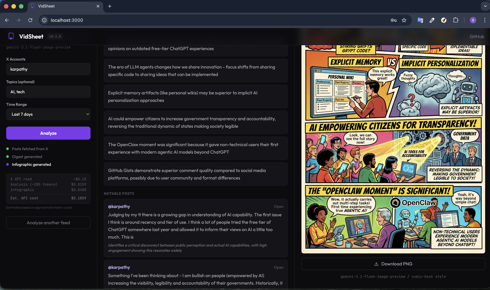

# FeedShot

[](LICENSE)

Paste a YouTube link or enter X accounts, provide your API keys, get structured content analysis + a comic-book style infographic. Zero sign-up, stateless, BYO keys.




## Architecture

```
Browser (React/Vite/TypeScript)
  |
  +---> POST /api/analyze
  |       |-> Supadata API (transcript extraction, user's key)
  |       |-> YouTube oEmbed API (video title)
  |       |-> Anthropic Claude analysis
  |       |-> Returns: structured JSON (TLDR, takeaways, social hook)
  |
  +---> POST /api/analyze-x-feed
  |       |-> X API v2 (fetch posts, user's bearer token)
  |       |-> Anthropic Claude digest synthesis
  |       |-> Returns: structured JSON (TLDR, takeaways, notable posts, social hook)
  |
  +---> POST /api/generate-image
          |-> Google Gemini image generation
          |-> Returns: base64 PNG infographic
```

## How It Works

**YouTube Mode**

1. Paste a YouTube URL
2. Enter your API keys (Supadata + Anthropic, optionally Gemini)
3. Get structured analysis + optional infographic

**X Feed Mode**

1. Enter X accounts to follow (comma-separated)
2. Enter your API keys (X Bearer Token + Anthropic, optionally Gemini)
3. Get a synthesised digest with key takeaways and notable posts

## Local Development

### Backend

```bash
python -m venv .venv
source .venv/bin/activate
pip install -r requirements.txt
uvicorn api.index:app --reload --port 8000
```

### Frontend

```bash
cd frontend
npm install
npm run dev
```

The Vite dev server proxies `/api` requests to `localhost:8000`.

### Both (parallel)

```bash
make run
```

### Tests

```bash
pip install pytest
pytest
```

## Stack

| Layer            | Technology                                     |
| ---------------- | ---------------------------------------------- |
| Frontend         | React 19, Vite, TypeScript, Tailwind CSS v4    |
| Backend          | FastAPI, Python 3.12+                          |
| AI Analysis      | Anthropic Claude (claude-sonnet-4-20250514)    |
| Image Generation | Google Gemini (gemini-3.1-flash-image-preview) |
| X Feed           | X API v2 (user's bearer token)                 |
| Transcript       | [Supadata](https://supadata.ai) API            |
| Hosting          | Vercel (static + serverless Python)            |

## Related

- [mcp-content-pipeline](https://github.com/berkayildi/mcp-content-pipeline) -- the MCP server this app wraps

## License

MIT
